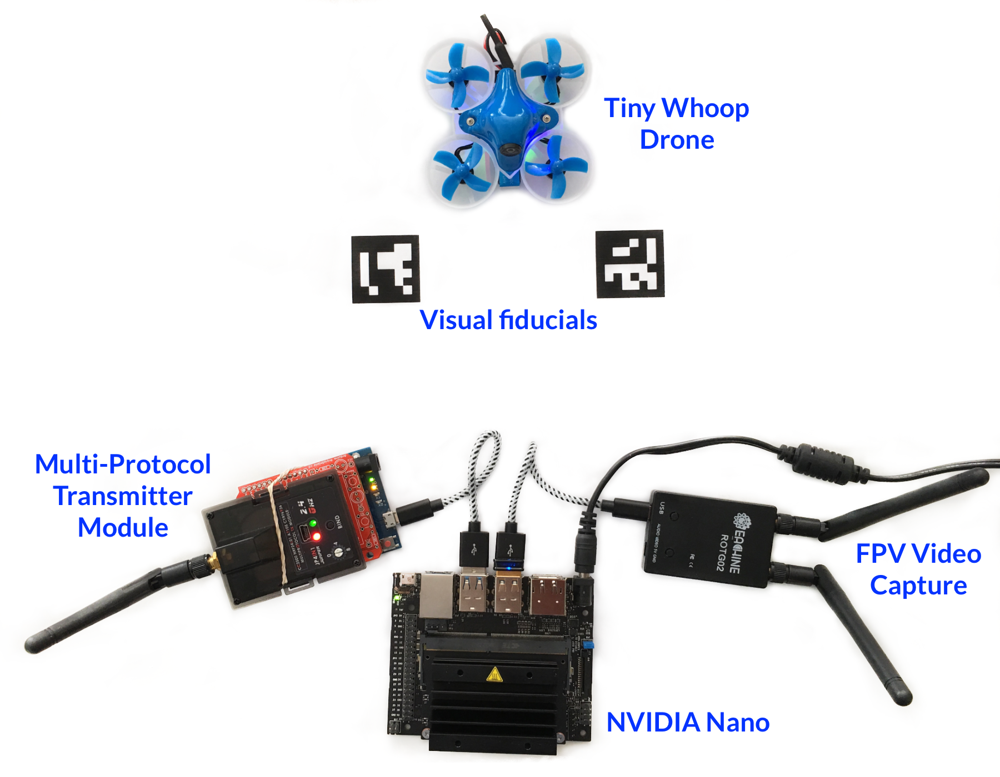

# The Firefly Challenge

The Firefly Challenge is an autonomous drone competition designed
around safe and low-cost hardware. Our hope is to provide a fun venue
that supports the development of clever autonomous flight software. We
know from experience that a lot of the real enjoyment will be from the
many screw-ups and failures we will have. We hope you decide to join
the fun.

The design is based on Tiny Whoop drones which are safe around humans,
low cost, supply first person video (FPV) and can be commanded
autonomously. The autonomy is supplied by a ground station that takes
in the drone's FPV, processes the video to determine a course of
action and then commands the drone to fly along the correct path.

This project is open source and currently under development. Over time
we hope to develop complete and mature hardware/software systems
autonomously controlling drones.

This repo outlines a complete hardware solution along with ideas and
suggestions on alternatives. It will also supply the necessary
software to race on a predefined course. We are hoping people will
take this work and extend it. Extra credit will be for those who
submit updates to the hardware and software designs or create and
document alternatives.

This effort was inspired by the
[Lockheed Martin AlphaPilot Challenge](https://www.lockheedmartin.com/en-us/news/events/ai-innovation-challenge.html).
We would like to think that the Firefly Challenge is exactly the same
as the AlphaPilot Challenge except:

* Safe for all participants and spectators
* Low-cost hardware based on easy to buy components
* Testing and competition happen in small and inexpensive venues
* Dumb drones controlled by smart ground stations
* No sponsorship
* No Internet glory
* A lot more fun because you can actually compete in the Firefly
  Challenge whereas the Lockheed AlphaPilot Challenge is very hard, if
  not toally impossible, for you to compete in

# The Hardware Components

The picture at the top of this page shows all the necessary components
to fly in a competition. This picture is one of our actual systems as
demonstrated by the rubber band to holding the Multi-Protocol
Transmitter Module to an Arduino. We should probably spec and use a
more reliable mounting technique.

This picture is only one possible hardware solution. Any of the
components shown can be swapped for other hardware to meet individual
needs or budget. In August of 2019 you would spend approximately $335
to purchase the hardware shown in the picture on Amazon.com. However,
it is possibly to use less expensive components (say a cheaper drone
or a Raspberry Pi) and lower the cost to about $190.

The complete hardware list can be found [here](docs/Hardware.md) with
setup instructions [here](docs/NanoSetup.md)

While we will document how to purchase and set up the solution shown,
we welcome any system that can fly a Tiny Whoop in a competition.

# How it Works

At the top of the picture is a **Tiny Whoop Drone**. This is what we
fly in the competitions. This drone has a First Person Video (FPV)
camera that points forward. You can see the front of the camera as the
small black lens sitting between the bottom two propellors. Once the
drone is powered up the camera starts broadcasting a video stream on a
5.8 GHz video channel.

The FPV video being broadcasted is captured by the **FPV Video
Capture** box. It is then transferred to the **NVIDIA Nano** over a
USB connection. The capture device is capable choosing one of 150
different channels and this allows multiple drones to be operating at
the same time as long as they transmit on different channels.

The **NVIDIA Nano** analyzes the incoming input video data and
determines the ultimate course of action for the drone. Once a flight
path has been determined the appropriate commands are generated and
transferred to the **Multi-Protocol Transmitter Module** over USB.

How the video is processed and converted into commands is the secret
sauce different participants will use to win the race. This repository
will ultimately have one or more off-the-shelf solutions to give
people a complete end-to-end solution that they can use immediately.
Once running they can modify or swap out components to create a better
racer.

The USB connection for the **Multi-Protocol Transmitter Module** is
actually supplied by an Arduino. The Arduino takes the commands coming
from the **NVIDIA Nano** and converts them into the protocol used by
the Multi-Protocol Transmitter Module. The **Multi-Protocol
Transmitter Module** then transmits the commands over radio to the
**Tiny Whoop Drone** for execution. The Tiny Whoop will follow the
commands sent and return updated video to start the process all over
again.

We place visual fiducials along the course to simplify and aid in the
image processing . Visual fiducials may sound high-falutin but they
are in fact a simple idea. Visual fiducials are patterns you can print
and they have a special property of being very easy to detect and
determine their orientation relative to the drone. Fiducials also can
encode a small amount of data like map-position-6 or gate-number-3. So
if the drone has two or more fiducials in camera's view it is possible
to determine the drone's position in three dimensional space.

Since we are in early days of our hardware and software development we
plan to make good use of visual fiducials. As our algorithms mature we
may decide to start and restrict their use and force more clever image
processing analysis.

# Reigning in Complexity

When our group started the Firefly Challenge we were drone neophytes.
This community has developed amazing technology, but we found
ourselves lost in the acronyms, formats, protocols and technologies.
Without guidance this world was not exactly user-friendly and our team
spent months coming up to speed. We also went down many ratholes.
Luckily we eventually found our way out and into a workable solution.

So this repository will document a limited number of solutions we know
to work. If you follow our instructions you should be able to build
and replicate our results. However, we acknowledge that there are many
other possibly choices and where possible we will attempt to outline
some of these other options and list any tradeoffs they force.

# Status

At the time of this writing we have functional hardware able to
support the basic Firefly Challenge. We are now documenting our design
and writing the software necessary to fly a race course.
