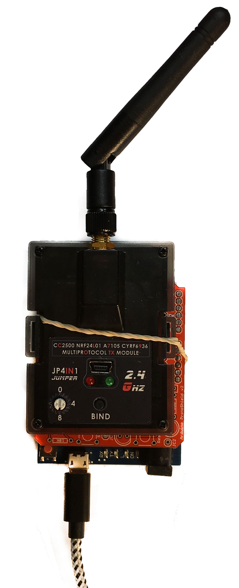

# Connecting Multi-Protocol Transmitter to Nano

To command the quadcopter's flight path we use a Multi-Protocol
Transmitter module. To convert from the 5V signal into the USB needed
by the NVIDIA Nano we use a Arduino Leonardo. The Leonardo is
programed to translate the commands from the NVIDIA Nano into the
correct signaling to the Multi-Protocol Transmitter Module.

We are using a Leonardo because it has two hardware UARTs. The first
connects to the Multi-Protocol Transmitter Module. The second is
attached to the USB connector output and connected to the Nano.

It takes four wires to connect Multi-Protocol Transmitter Module to
the Leonardo. Let's number the pins Multi-Protocol Transmitter Module
starting at the pin CLOSEST to the corner of the box. It will be
pin 1. The pin nearer the middle is pin 5.

| Module Pin | Leonardo Pin |
| ---------- | ------------ |
|     1      |    D0 (RX)   |
|     2      |      GND     |
|     3      |       5V     |
|     4      |       -      |
|     5      |    D1 (TX)   |

The software to load in the Leonardo can be found in the
*src/transmitter* directory.

Once programmed you can connect it to the Nano.
