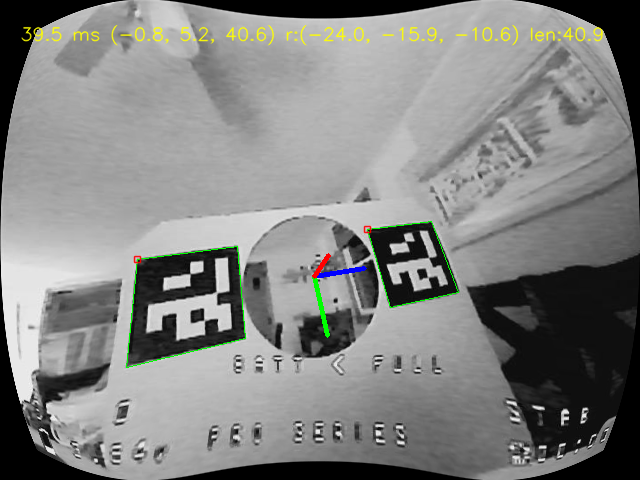

# Experimental Directory

This directory holds code for various experiments on analysis.

```
.
├── README.md            -- This README.
├── calibration.npz      -- Camera calibration for Beta65 Pro.
├── images               -- Test images.
│   ├── raw_image_0.png
│   ├── raw_image_1.png
│   ├── ...
│   └── raw_image_8.png
│
├── batch.py             -- Analyze the images in 'images' and calculate pose.
├── drive.py             -- Test drive the command library to fly quadcopter.
├── justvideo.py         -- Show the drone camera on the screen.
├── live.py              -- Live video version pose detection.
├── makearuco.py         -- Create Aruco fiducial markers.
├── oneimage.py          -- Process one image with pose detection.
├── save_calibration.py  -- Create 'calibration.npz'.
├── testpid.py           -- Run the PID library and output results.
│
├── command.py           -- Command the quadcopter transmitter.
├── fly.py               -- Take image data and drive drone.
├── pid.py               -- PID library.
└── pose.py              -- Pose library.
```

## Images

The 'images' directory has a series of images to test algorithms
against. A series of images were taken at different orientations from
the target.

## Processing

`justvideo.py` shows the drone camera on the screen. You can use this
to verify that that data path from the drone, through the FPV Video
Receiver and all the way into the NVIDIA Nano works. It also verifies
that Python and OpenCV are set up correctly.

`drive.py` drives the quadcopter from a command line for testing.

`batch.py`, `live.py`, and `oneimage.py` all perform the same basic
pose processing just in different contexts. All the processing code
can be found in `pose.py`.

`batch.py` runs pose processing on all the images in `images` and
places the results in the `results` directory. It will create this
directory if needed.

`live.py` grabs a live video frame, processes it and outputs the
results to the screen. It runs until the user types 'q' into the
output window. If the user types 'c' it captures the intput and result
image and writes them to disk.

`oneimage.py` processes a single image (which can be specified) and
outputs the results to the screen.

`makearuco.py` create visual fiducials that can be printed and used on
the gates.

`save_calibration.py` creates calibration data.

The processed image looks like this:

